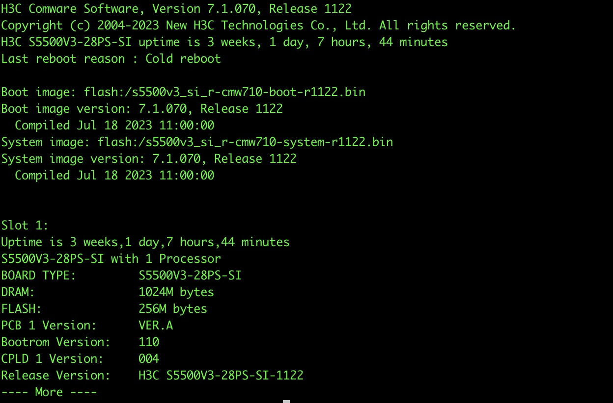

# gmiko
netmiko for go, a multi-vendor library to create SSH connections to network devices

# how to use

H3C
```
d, err := gmiko.NewDevice("h3c", "comware", "192.168.10.200", 22, "username", "password")
	if err != nil {
		log.Fatalf("gmiko new device failed: %s\n", err.Error())
	}

	err = d.Connect(3)
	if err != nil {
		log.Fatalf("gmiko connect device failed: %s\n", err.Error())
	}
	defer d.Disconnect()

	v, err := d.RunCommand("display version")
	if err != nil {
		log.Fatalf("gmiko run command failed: %s\n", err.Error())
	}
	fmt.Printf("%s\n", string(v))
```



Huawei
```
d, err := gmiko.NewDevice("huawei", "vrp", "host", port, "username", "password")
	if err != nil {
		log.Fatalf("gmiko new device failed: %s\n", err.Error())
	}

	err = d.Connect(3)
	if err != nil {
		log.Fatalf("gmiko connect device failed: %s\n", err.Error())
	}
	defer d.Disconnect()

	v, err := d.RunCommand("display version")
	if err != nil {
		log.Fatalf("gmiko run command failed: %s\n", err.Error())
	}
	fmt.Printf("%s\n", string(v))
```


Cisco
```
  opt := gmiko.SecretOption("secret")
  d, err := gmiko.NewDevice("cisco", "ios", "host", port, "username", "password", opt)
	if err != nil {
		log.Fatalf("gmiko new device failed: %s\n", err.Error())
	}

	err = d.Connect(3)
	if err != nil {
		log.Fatalf("gmiko connect device failed: %s\n", err.Error())
	}
	defer d.Disconnect()

	v, err := d.RunCommand("show version")
	if err != nil {
		log.Fatalf("gmiko run command failed: %s\n", err.Error())
	}
	fmt.Printf("Version: %s\n", string(v))
```

ruijie
```
  opt := gmiko.SecretOption("secret")
  d, err := gmiko.NewDevice("ruijie", "rgos", "host", port, "username", "password", opt)
	if err != nil {
		log.Fatalf("gmiko new device failed: %s\n", err.Error())
	}

	err = d.Connect(3)
	if err != nil {
		log.Fatalf("gmiko connect device failed: %s\n", err.Error())
	}
	defer d.Disconnect()

	v, err := d.RunCommand("show version")
	if err != nil {
		log.Fatalf("gmiko run command failed: %s\n", err.Error())
	}
	fmt.Printf("Version: %s\n", string(v))
```

# support device
|  manufacture   |  os  |
|  ----     |    ----    |  
| H3C       |   comware  |
| huawei    |   vrp      |
| cisco     |   ios      |
| ruijie    |   rgos     |

# todo list
